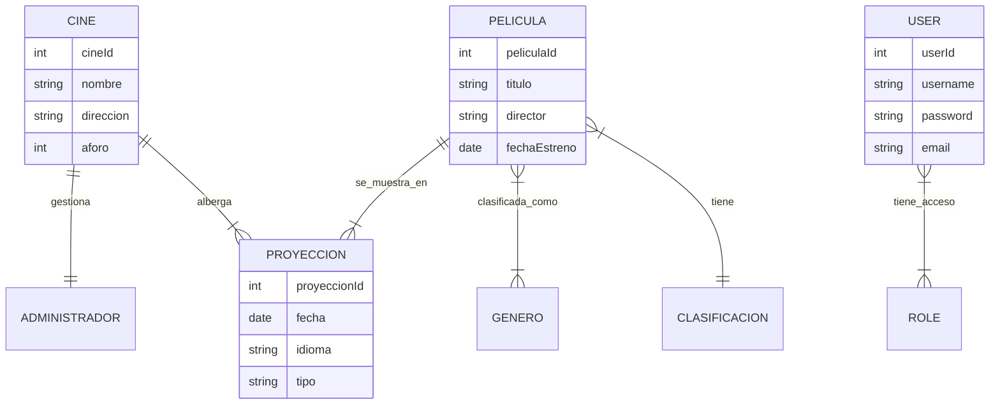

# 🎬 API REST de Gestión de Cines

[](https://www.oracle.com/java/)
[](https://spring.io/projects/spring-boot)
[](https://www.mysql.com/)
[](https://spring.io/projects/spring-security)

> Una API REST robusta diseñada para gestionar las operaciones backend de una cadena de cines, incluyendo programación de películas, gestión de usuarios y seguridad basada en roles.

**Creado por Diego Rivera**

---

### 🔗 Navegación
*   **[Ver Código en GitHub](https://github.com/dariverap/SpringBoot-ApiREST-Cinema)** *(Enlace Placeholder)*
*   🇺🇸 **[English Version](./README.md)**

---

## 📖 Introducción

Este proyecto implementa una solución backend para un sistema de gestión de cines. Proporciona endpoints seguros para administrar recursos como Películas, Cines, Proyecciones, Géneros y Usuarios.

**Valor del Negocio:**
*   **Gestión Centralizada:** Control unificado sobre los activos del cine y la programación.
*   **Seguridad:** Implementa codificación de contraseñas con `BCrypt` y Control de Acceso Basado en Roles (RBAC) para prevenir modificaciones no autorizadas de datos sensibles.
*   **Escalabilidad:** Construido sobre el ecosistema Spring, permitiendo un escalado horizontal sencillo.

---

## 🏗 Arquitectura

El proyecto sigue una **Arquitectura en Capas** estándar para asegurar la separación de responsabilidades.

### Árbol del Proyecto
```bash
src/main/java/pe/idat
├── controller/       # Controladores REST (Endpoints de la API)
├── entity/           # Entidades JPA (Modelos de Base de Datos)
├── mapper/           # Lógica de mapeo de objetos/DTOs
├── repository/       # Interfaces de Acceso a Datos (Spring Data JPA)
├── security/         # Configuración de Seguridad (Permisos y Auth)
├── service/          # Lógica de Negocio y Gestión de Transacciones
├── util/             # Clases de ayuda
└── vo/               # Value Objects (Mapeos de relaciones)
```

### Diagrama Entidad-Relación (ERD)
El siguiente diagrama ilustra el esquema central de la base de datos derivado de las entidades JPA.



---

## 🛠 Stack Tecnológico

*   **Lenguaje:** Java 17
*   **Framework:** Spring Boot 2.7.12
    *   Spring Web (REST)
    *   Spring Data JPA (ORM)
    *   Spring Security (Auth & RBAC)
*   **Base de Datos:** MySQL 5/8
*   **Herramienta de Construcción:** Maven

---

## 🔌 Referencia de la API

La API está protegida. Los endpoints requieren Autenticación Básica dependiendo del rol (`ADMINISTRADOR`, `SUPERVISOR`, `CLIENTE`).

### Ejemplo: Listar Cines
Recupera una colección de todos los cines registrados.

*   **URL:** `/cines/listar`
*   **Método:** `GET`
*   **Auth:** `CLIENTE`, `SUPERVISOR`, o `ADMINISTRADOR`

#### Ejemplo de Respuesta (JSON)
```json
[
  {
    "cineId": 1,
    "nombre": "CineStar Centro",
    "direccion": "Av. Principal 123",
    "numeroSalas": 5,
    "aforo": 200,
    "administrador": "Diego Rivera"
  },
  {
    "cineId": 2,
    "nombre": "CineStar Sur",
    "direccion": "Calle Lima 456",
    "numeroSalas": 8,
    "aforo": 350,
    "administrador": "Juan Perez"
  }
]
```

#### Ejemplo CURL
```bash
curl -u usuario:password -X GET http://localhost:8090/idat/cines/listar
```

---

## 🚀 Instalación y Configuración

1.  **Clonar el repositorio**
    ```bash
    git clone <repository_url>
    cd ProyectoRest
    ```

2.  **Configurar Base de Datos**
    Asegúrate de que MySQL esté corriendo. Crea una base de datos llamada `db_cine` o actualiza `src/main/resources/application.properties`:
    ```properties
    spring.datasource.url=jdbc:mysql://localhost:3306/db_cine?createDatabaseIfNotExist=true&useSSL=false
    spring.datasource.username=root
    spring.datasource.password=tu_contraseña
    ```

3.  **Construir el proyecto**
    ```bash
    ./mvnw clean install
    ```

4.  **Ejecutar la aplicación**
    ```bash
    ./mvnw spring-boot:run
    ```
    La API estará disponible en: `http://localhost:8090/idat`
