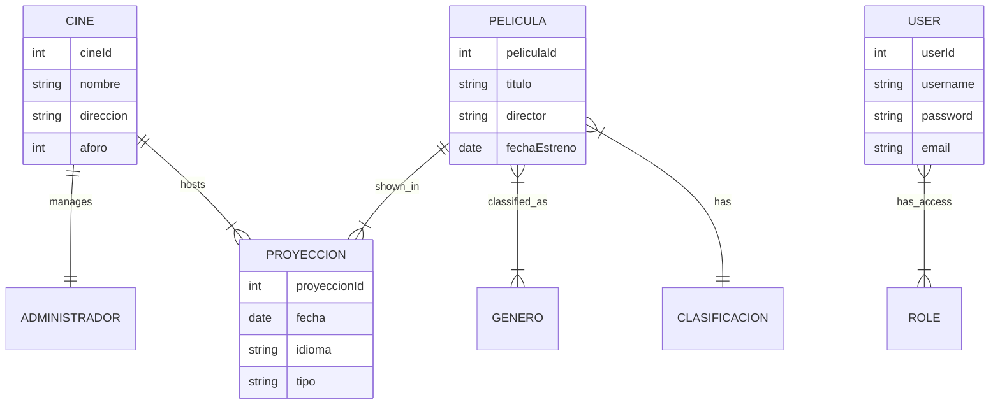

# 🎬 Cinema Management REST API

[](https://www.oracle.com/java/)
[](https://spring.io/projects/spring-boot)
[](https://www.mysql.com/)
[](https://spring.io/projects/spring-security)

> A robust RESTful API designed to manage the backend operations of a Cinema chain, including movie scheduling, user management, and role-based security.

**Created by Diego Rivera**

---

### 🔗 Navigation
*   **[View Code on GitHub](https://github.com/dariverap/SpringBoot-ApiREST-Cinema)** *(Placeholder Link)*
*   🇪🇸 **[Versión en Español](./README.es.md)**

---

## 📖 Introduction

This project implements a backend solution for a Cinema management system. It provides secure endpoints to manage resources such as Movies, Cinemas, Screenings (Proyecciones), Genres, and Users.

**Business Value:**
*   **Centralized Management:** Unified control over cinema assets and scheduling.
*   **Security:** Implements `BCrypt` password encoding and Role-Based Access Control (RBAC) preventing unauthorized modification of sensitive data.
*   **Scalability:** Built on the Spring ecosystem, allowing for easy horizontal scaling.

---

## 🏗 Architecture

The project follows a standard **Layered Architecture** ensuring separation of concerns.

### Project Tree
```bash
src/main/java/pe/idat
├── controller/       # REST Controllers (API Endpoints)
├── entity/           # JPA Entities (Database Models)
├── mapper/           # DTO/Object Mapping Logic
├── repository/       # Data Access Interfaces (Spring Data JPA)
├── security/         # Security Config (Permissions & Auth)
├── service/          # Business Logic & Transaction Management
├── util/             # Helper classes
└── vo/               # Value Objects (Relation mappings)
```

### Entity Relationship Diagram (ERD)
The following diagram illustrates the core database schema derived from the JPA entities.



---

## 🛠 Tech Stack

*   **Language:** Java 17
*   **Framework:** Spring Boot 2.7.12
    *   Spring Web (REST)
    *   Spring Data JPA (ORM)
    *   Spring Security (Auth & RBAC)
*   **Database:** MySQL 5/8
*   **Build Tool:** Maven

---

## 🔌 API Reference

The API is secured. Endpoints require Basic Auth depending on the role (`ADMINISTRADOR`, `SUPERVISOR`, `CLIENTE`).

### Example: List Cinemas
Retrieves a collection of all registered cinemas.

*   **URL:** `/cines/listar`
*   **Method:** `GET`
*   **Auth:** `CLIENTE`, `SUPERVISOR`, or `ADMINISTRADOR`

#### Response Example (JSON)
```json
[
  {
    "cineId": 1,
    "nombre": "CineStar Centro",
    "direccion": "Av. Principal 123",
    "numeroSalas": 5,
    "aforo": 200,
    "administrador": "Diego Rivera"
  },
  {
    "cineId": 2,
    "nombre": "CineStar Sur",
    "direccion": "Calle Lima 456",
    "numeroSalas": 8,
    "aforo": 350,
    "administrador": "Juan Perez"
  }
]
```

#### CURL Example
```bash
curl -u username:password -X GET http://localhost:8090/idat/cines/listar
```

---

## 🚀 Installation & Setup

1.  **Clone the repository**
    ```bash
    git clone <repository_url>
    cd ProyectoRest
    ```

2.  **Configure Database**
    Ensure MySQL is running. Create a database named `db_cine` or update `src/main/resources/application.properties`:
    ```properties
    spring.datasource.url=jdbc:mysql://localhost:3306/db_cine?createDatabaseIfNotExist=true&useSSL=false
    spring.datasource.username=root
    spring.datasource.password=your_password
    ```

3.  **Build the project**
    ```bash
    ./mvnw clean install
    ```

4.  **Run the application**
    ```bash
    ./mvnw spring-boot:run
    ```
    The API will be available at: `http://localhost:8090/idat`
